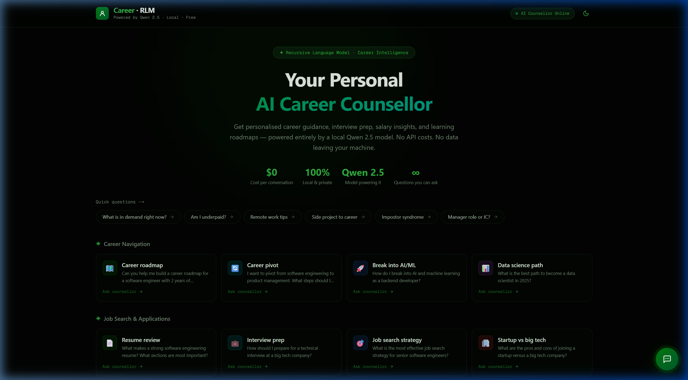
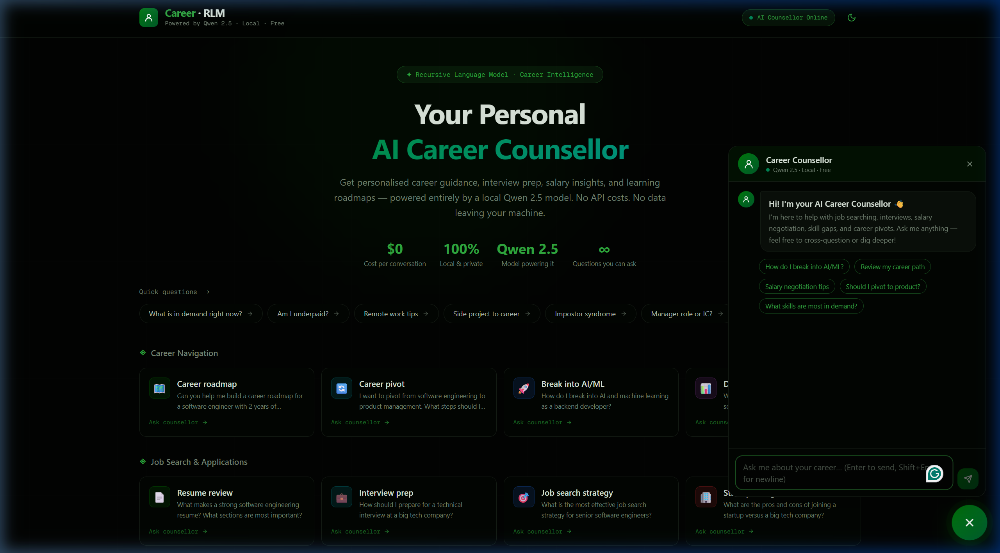
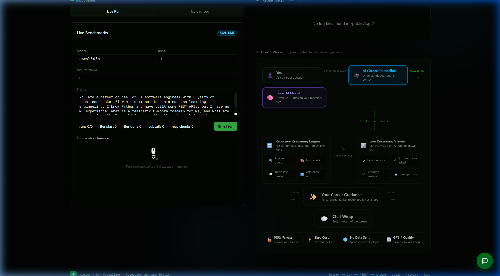

---

<h1 align="center" style="font-size:2.8em">
<span>Recursive Language Models (<span style="color:orange">RLM</span>s)</span>
</h1>

<p align="center" style="font-size:1.3em">
  <a href="https://arxiv.org/abs/2512.24601">Full Paper</a> •
  <a href="https://alexzhang13.github.io/blog/2025/rlm/">Blogpost</a> •
  <a href="https://alexzhang13.github.io/rlm/">Documentation</a> •
  <a href="https://github.com/alexzhang13/rlm-minimal">RLM Minimal</a>
</p>

<p align="center">
  <a href="https://github.com/alexzhang13/rlm/actions/workflows/style.yml">
    
  </a>
  <a href="https://github.com/alexzhang13/rlm/actions/workflows/test.yml">
    
  </a>
</p>

---

## 🎓 AI Career Counsellor — Powered by RLMs

> **The visualizer has been upgraded into a fully interactive AI Career Counsellor.** Using a local Qwen 2.5 model + recursive reasoning, it gives personalised career guidance — completely free, 100% private, and running on your own machine.

<p align="center">
  
  <br/><em>Landing page — quick topic cards, chat widget, and $0 cost stats</em>
</p>

### What it can do

| Feature | Details |
|---|---|
| 💬 **Chat counsellor** | Ask career questions in natural language — streams responses token-by-token |
| 🔍 **Thinking phases** | Watch the AI analyse your query, pull context, and construct an answer step by step |
| 📊 **Live trace viewer** | See every reasoning iteration, sub-call, and execution step as it happens |
| 🗂️ **Topic cards** | One-click prebuilt questions: career pivots, salary negotiation, interview prep, and more |
| 🔁 **Recursive reasoning** | Complex questions are broken into sub-questions and answered depth-first |
| 🔒 **Fully local** | Qwen 2.5 runs on your machine via Ollama — no data sent anywhere, no API costs |

<p align="center">
  
  <br/><em>Chat widget with thinking-phase animation and quick starter chips</em>
</p>

<p align="center">
  
  <br/><em>Live benchmark runner (left) and the animated "How It Works" flow diagram (right)</em>
</p>

---

## Overview

Recursive Language Models (RLMs) are a task-agnostic inference paradigm for language models (LMs) to handle near-infinite length contexts by enabling the LM to *programmatically* examine, decompose, and recursively call itself over its input. RLMs replace the canonical `llm.completion(prompt, model)` call with a `rlm.completion(prompt, model)` call. RLMs offload the context as a variable in a REPL environment that the LM can interact with and launch sub-LM calls inside of.

This repository provides an extensible inference engine for using RLMs around standard API-based and local LLMs. The initial experiments and idea were proposed in a [blogpost](https://alexzhang13.github.io/blog/2025/rlm/) in 2025, with expanded results in an [arXiv preprint](https://arxiv.org/abs/2512.24601).

> [!NOTE]
> This repository contains inference code for RLMs with support for various sandbox environments. Open-source contributions are welcome. This repository is maintained by the authors of the paper from the MIT OASYS lab.

---

## 🚀 Quick Start — AI Career Counsellor (Docker)

The easiest way to run the full stack (Ollama + benchmark server + web UI) is with Docker Compose:

```bash
# 1. Clone and start
git clone https://github.com/alexzhang13/rlm.git
cd rlm
docker compose up -d --build

# 2. Pull the model (first time only)
docker compose exec ollama ollama pull qwen2.5:0.5b

# 3. Open the career counsellor
open http://localhost:3001
```

That's it — the counsellor is live at **http://localhost:3001**.

### What gets started

| Service | Port | Purpose |
|---|---|---|
| `ollama` | 11434 | Local Qwen 2.5 model server |
| `benchmark` | — | Python RLM benchmark runner |
| `gui` | 3001 | Next.js career counsellor + trace viewer |

---

## 🧑‍💻 Python Library Quick Setup

You can try out RLMs quickly by installing from PyPi:
```bash
pip install rlms
```

The default RLM client uses a REPL environment that runs on the host process through Python `exec` calls. As an example, we can call RLM completions using GPT-5-nano:
```python
from rlm import RLM

rlm = RLM(
    backend="openai",
    backend_kwargs={"model_name": "gpt-5-nano"},
    verbose=True,  # For printing to console with rich, disabled by default.
)

print(rlm.completion("Print me the first 100 powers of two, each on a newline.").response)
```

<details>
<summary><b>Manual Setup</b></summary>

Set up the dependencies with `uv` (or your virtual environment of choice):
```bash
curl -LsSf https://astral.sh/uv/install.sh | sh
uv init && uv venv --python 3.12  # change version as needed
uv pip install -e .
```

This project includes a `Makefile` to simplify common tasks.

- `make install`: Install base dependencies.
- `make check`: Run linter, formatter, and tests.

To run a quick test, the following will run an RLM query with the OpenAI client using your environment variable `OPENAI_API_KEY`:
```bash
make quickstart
```

</details>

---

## 🖥️ Visualizer — Career Counsellor UI

### Running the visualizer locally (without Docker)

```bash
cd visualizer/
npm install
npm run dev        # http://localhost:3001
```

### Key UI features

#### 1. Chat with the AI Career Counsellor
Open the 💬 button in the bottom-right. The counsellor:
- **Streams** responses token-by-token (typewriter effect)
- Shows **thinking phases** before the first token: *Analyzing query → Pulling model weights → Constructing context → Generating response*
- Tracks **session token counts** and estimates cloud vs local cost savings

#### 2. Live Benchmark Runner
The "Live Run" tab lets you:
- Enter a custom career counselling prompt
- Watch iterations arrive in real time via a **live timeline card strip**
- Inspect the full **Execution Timeline** — each event (iteration start/complete, sub-calls, errors) shown with colour-coded icons
- View the final answer extracted from the run

#### 3. Trajectory Viewer
Click any completed run card to open the full deep-dive:
- **Iteration timeline** with token counts and duration
- **Conversation panel** — per-iteration LLM responses with code block detection and sub-call highlighting
- **Code & Sub-LM Calls** panel — execution output and recursive call details
- **Final Answer** — expandable rich-text view with "show full answer" toggle

#### 4. Topic Cards
Pre-built career questions organised by category:

| Category | Examples |
|---|---|
| Career Navigation | Career roadmap, Career pivot, Break into AI/ML |
| Job Search | Resume review, Interview prep, Job search strategy |
| Skills & Learning | Skills gap analysis, Learning roadmap, Certifications |
| Compensation | Salary negotiation, Equity explainer, Market rate check |

Clicking any card opens the chat with the question pre-filled.

---

## REPL Environments

We support two types of REPL environments — isolated, and non-isolated.

```python
rlm = RLM(
    environment="...", # "local", "docker", "modal", "prime", "daytona", "e2b"
    environment_kwargs={...},
)
```

### Local Environments
The default `local` environment `LocalREPL` runs in the same process as the RLM itself, with specified global and local namespaces for minimal security.

#### Docker  (*requires [Docker installed](https://docs.docker.com/desktop/setup/install/)*)
We also support a Docker-based environment called `DockerREPL` that launches the REPL environment as a Docker image.

### Isolated Environments

#### Modal Sandboxes 
To use [Modal Sandboxes](https://modal.com/docs/guide/sandboxes):
```bash
uv add modal
modal setup
```

#### Prime Intellect Sandboxes 
> [!NOTE]
> **Prime Intellect Sandboxes** are currently a beta feature.

```bash
uv pip install -e ".[prime]"
export PRIME_API_KEY=...
```

---

## Model Providers

We currently support most major clients (OpenAI, Anthropic), as well as router platforms (OpenRouter, Portkey). For local models, we recommend using Ollama or vLLM. To view or add more clients, see [`rlm/clients/`](https://github.com/alexzhang13/rlm/tree/main/rlm/clients).

### Local Models + Docker REPL
RLM separates **model inference backend** from **code execution environment**:

- Inference backend: where model tokens are generated (`backend="vllm"` or `backend="openai"` + `base_url`).
- REPL environment: where generated Python runs (`environment="docker"`, `"local"`, etc).

```python
from rlm import RLM

rlm = RLM(
  backend="vllm",
  backend_kwargs={
    "model_name": "meta-llama/Llama-3.1-8B-Instruct",
    "base_url": "http://127.0.0.1:8000/v1",
    "api_key": "EMPTY",
  },
  environment="docker",
  environment_kwargs={"image": "python:3.11-slim"},
)

result = rlm.completion("Summarize this context in 3 bullet points.")
print(result.response)
```

### Single Container: App + LLM Together (Ollama)

```bash
docker build -t rlm-all-in-one .
docker run --rm --gpus all \
  -e OLLAMA_MODEL=qwen2.5:0.5b \
  -e APP_CMD="python -m examples.local_model_docker_benchmark --backend openai --environment local --base-url http://127.0.0.1:11434/v1 --model qwen2.5:0.5b --api-key EMPTY --runs 3" \
  -v ollama-data:/root/.ollama \
  -p 11434:11434 \
  rlm-all-in-one
```

### Docker Compose: GUI + GPU + Benchmarks

```bash
# Start everything
docker compose up -d --build ollama benchmark gui

# Pull a model (once)
docker compose exec ollama ollama pull qwen2.5:0.5b

# Run a benchmark while GUI stays live
docker compose exec benchmark python -m examples.local_model_docker_benchmark \
  --backend openai \
  --environment local \
  --base-url http://ollama:11434/v1 \
  --model qwen2.5:0.5b \
  --api-key EMPTY \
  --runs 3

# Monitor logs
docker compose logs -f gui
docker compose logs -f ollama
```

---

## Optional: Trajectory Logging

```python
from rlm.logger import RLMLogger
from rlm import RLM

logger = RLMLogger(log_dir="./logs")
rlm = RLM(..., logger=logger)
```

- **In-memory only** (trajectory on `completion.metadata`): `logger=RLMLogger()` (no `log_dir`).
- **Save to disk** (JSONL for the visualizer): `logger=RLMLogger(log_dir="./logs")`.

---

## Relevant Reading
* **[Dec '25]** [Recursive Language Models arXiv](https://arxiv.org/abs/2512.24601)
* **[Oct '25]** [Recursive Language Models Blogpost](https://alexzhang13.github.io/blog/2025/rlm/)

If you use this code or repository in your research, please cite:

```bibtex
@misc{zhang2026recursivelanguagemodels,
      title={Recursive Language Models},
      author={Alex L. Zhang and Tim Kraska and Omar Khattab},
      year={2026},
      eprint={2512.24601},
      archivePrefix={arXiv},
      primaryClass={cs.AI},
      url={https://arxiv.org/abs/2512.24601},
}
```
